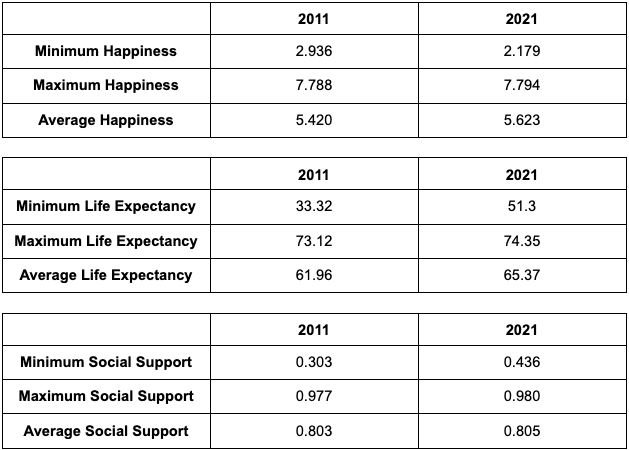

```{r load-packages, include = FALSE}
# Add any additional packages you need to this chunk
library(tidyverse)
library(palmerpenguins)
library(knitr)
library(xaringanthemer)
library(janitor)
library(readxl)
DataForTable2_1 <- read_excel("DataForTable2.1.xls") %>%
clean_names()
```

```{r setup, include=FALSE}
# For better figure resolution
knitr::opts_chunk$set(fig.retina = 3, dpi = 300, fig.width = 6, fig.asp = 0.618, out.width = "80%")
```

```{r load-data, include=FALSE}
# Load your data here
```

```{r include=FALSE}
style_xaringan(
  title_slide_background_image = "img/2x97kx7f.jpg"
)
```

class: center, middle

## What effect does Life Expectancy and Social Support have on Overall Happiness in the World?

---

class: inverse, center, middle

# Introduction

---

# Data Set

- Our data set is the World Happiness Report

- From the World Happiness Report website (https://worldhappiness.report/ed/2022)

- 12 variables and 2089 observations

- Variables: Country Name, Year, Life Ladder, log GDP per capita, Social support, Healthy life expectancy at birth, Freedom to make life choices, Generosity, Perceptions of corruption, Positive affect, Negative affect, Confidence in national government

---

# Data set

```{r showing data set, echo = FALSE}

glimpse(DataForTable2_1)

```
---

# Variables

- Life Ladder quantified the level of happiness


- The the effects of social_support  and healthy_life_expectancy_at_birth will be focused on.

- The effects will also be compared between years and continents (Another dataset contains continents and countries will be joint to the main one). 

---
# Life Expectancy

```{r life expectancy graph, echo = FALSE}
DataForTable2_1 %>%
  filter(
    year == 2021,
    healthy_life_expectancy_at_birth != "NA",
    life_ladder != "NA"
  ) %>%
  ggplot(aes(x = healthy_life_expectancy_at_birth, y = life_ladder)) +
  geom_point() +
  geom_smooth(
    formula = y ~ x,
    method = lm
  ) +
  ggpubr::stat_regline_equation(
    formula = y ~ x,
    show.legend = FALSE
  )

```
---

# Social Support

```{r social support, echo = FALSE}
DataForTable2_1 %>%
  filter(
    year == 2021,
    social_support != "NA",
    life_ladder != "NA"
  ) %>%
  ggplot(aes(x = social_support, y = life_ladder)) +
  geom_point() +
  geom_smooth(
    formula = y ~ x,
    method = lm
  ) +
  ggpubr::stat_regline_equation(
    formula = y ~ x,
    show.legend = FALSE
  )

```
---

# xaringan

- The presentation is created using the `xaringan` package

- Use `---` to separate slides and `--` for incremental builds

--

- Like this

---

# Layouts

You can use plain text

- or bullet points

.pull-left[
or text in two columns $^*$
]
.pull-right[
- like
- this
]

.footnote[
[*] And add footnotes
]

---

# Code

```{r boring-analysis}
# a boring analysis
ave <- mean(cars$dist)
print(ave)
```

---

# Plots

```{r recode-species, echo = FALSE}
# In this chunk I'm doing a bunch of analysis that I don't want to present 
# in my slides. But I need the resulting data frame for a plot I want to present.
iris_modified <- iris %>%
  mutate(Species = fct_other(Species, keep = "setosa"))
```

```{r plot-iris, echo = FALSE}
DataForTable2_1 %>%
  filter(
    year == 2021,
    healthy_life_expectancy_at_birth != "NA",
    life_ladder != "NA"
  ) %>%
  ggplot(aes(x = healthy_life_expectancy_at_birth, y = life_ladder)) +
  geom_point() +
  geom_smooth(
    formula = y ~ x,
    method = lm
  ) +
  ggpubr::stat_regline_equation(
    formula = y ~ x,
    show.legend = FALSE
  )

```

---

## Plot and text

.pull-left[
- Some text
- goes here
]
.pull-right[
```{r warning=FALSE, out.width="100%", fig.width=4, echo=FALSE}
# see how I changed out.width and fig.width from defaults
# to make the figure bigger
ggplot(penguins, aes(x = bill_length_mm, y = species, color = species)) +
  geom_boxplot() +
  theme_minimal()
```
]

---

# Summary Statistics

```{r castle, echo = FALSE, out.width = "60%", fig.align = "center"}

```


---

# Future Statistics

```{echo = FALSE, include = FALSE}

DataForTable2_1 %>%
  select(country_name, year, life_ladder, healthy_life_expectancy_at_birth, social_support) %>%
  filter(year == "2011" & healthy_life_expectancy_at_birth != "NA" & social_support != "NA") %>%
  summarise(
            min_happiness = min(life_ladder),
            max_happiness = max(life_ladder),
            avg_happiness = mean(life_ladder),
            min_life_expectancy = min(healthy_life_expectancy_at_birth),
            max_life_expectancy = max(healthy_life_expectancy_at_birth),
            avg_life_expectancy = mean(healthy_life_expectancy_at_birth),
            min_social_support = min(social_support),
            max_social_support = max(social_support),
            avg_social_support = mean(social_support))

DataForTable2_1 %>%
  select(country_name, year, life_ladder, healthy_life_expectancy_at_birth, social_support) %>%
  filter(year == "2021" & healthy_life_expectancy_at_birth != "NA" & social_support != "NA") %>%
  summarise(
            min_happiness = min(life_ladder),
            max_happiness = max(life_ladder),
            avg_happiness = mean(life_ladder),
            min_life_expectancy = min(healthy_life_expectancy_at_birth),
            max_life_expectancy = max(healthy_life_expectancy_at_birth),
            avg_life_expectancy = mean(healthy_life_expectancy_at_birth),
            min_social_support = min(social_support),
            max_social_support = max(social_support),
            avg_social_support = mean(social_support))
```

Statistics and more that would be useful in answering our question:
  - linear regression models
  - correlation coefficient (r)
  - coefficient of determination (R^2)

Results that would support our hypothesized answer:
  - high correlation coefficient
  - high coefficient of determination to show our linear regressions are good models for          the data

---

background-image: url(https://images.unsplash.com/photo-1535448033526-c0e85c9e6968?ixlib=rb-1.2.1&ixid=eyJhcHBfaWQiOjEyMDd9&auto=format&fit=crop&w=1650&q=80)

---

# Math Expressions

You can write LaTeX math expressions inside a pair of dollar signs, e.g. &#36;\alpha+\beta$ renders $\alpha+\beta$. You can use the display style with double dollar signs:

```
$$\bar{X}=\frac{1}{n}\sum_{i=1}^nX_i$$
```

$$\bar{X}=\frac{1}{n}\sum_{i=1}^nX_i$$

Limitations:

1. The source code of a LaTeX math expression must be in one line, unless it is inside a pair of double dollar signs, in which case the starting `$$` must appear in the very beginning of a line, followed immediately by a non-space character, and the ending `$$` must be at the end of a line, led by a non-space character;

1. There should not be spaces after the opening `$` or before the closing `$`.

1. Math does not work on the title slide (see [#61](https://github.com/yihui/xaringan/issues/61) for a workaround).

---

# Feeling adventurous?

- Want to find out more about `xaringan`? See https://slides.yihui.name/xaringan/#1.

- You are welcomed to use the default styling of the slides. In fact, that's what I expect majority of you will do. You will differentiate yourself with the content of your presentation.

- But some of you might want to play around with slide styling. The 
`xaringanthemer` provides some solutions for this that: https://pkg.garrickadenbuie.com/xaringanthemer.

- And if you want more bells and whistles, there is also `xaringanExtra`: https://pkg.garrickadenbuie.com/xaringanExtra.
